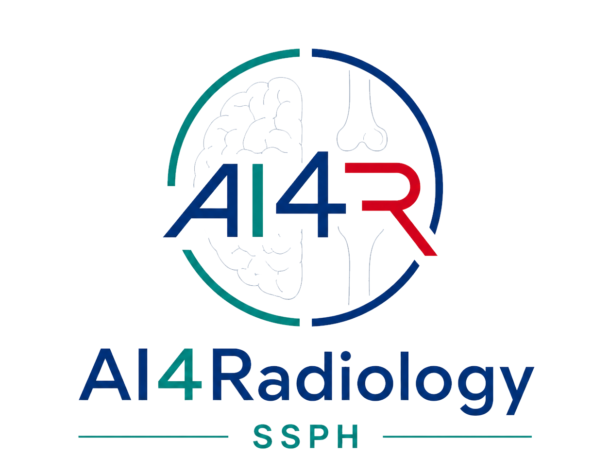

<p align="center">
  <a href="README.zh-CN.md">🌐 中文</a> &nbsp;·&nbsp; <strong>English</strong>
</p>

<div align="center">



# AI4Rad Lab · Medical Imaging AI

**Medical Imaging Artificial Intelligence Laboratory**<br>
Department of Radiology, Shanghai Sixth People's Hospital ·
Shanghai Jiao Tong University School of Medicine

<h3>🌐 <a href="https://ai4rad-ssph.github.io/">ai4rad-ssph.github.io</a></h3>


[](https://ai4rad-ssph.github.io/)
[](https://ai4rad-ssph.github.io/publications.html)
[](https://ai4rad-ssph.github.io/team.html)
[](LICENSE)

</div>

---

The official website of **AI4Rad Lab**, a medical imaging AI research group at the
Department of Radiology, Shanghai Sixth People's Hospital (SJTU School of Medicine).

We build AI that works in real clinical radiology — from vessel segmentation and
perfusion analysis to large-scale disease diagnosis and automated reporting. Our core
clinical directions are **pan-vascular imaging** (cerebrovascular, cardiac & coronary,
and peripheral vasculature) and **musculoskeletal imaging**, alongside broader
radiology applications, all driving the **clinical translation** of medical AI.

## 🔬 Research directions

Our research is built on four core AI capabilities, applied across the lab's seven clinical imaging directions.

- **Vision foundation models** — visual representation and structured understanding of medical images: diagnosis, segmentation, detection, and quantification.
- **Multimodal large language models** — integrating images, reports, clinical history, and knowledge for diagnostic reasoning and structured reporting.
- **Medical image generation** — clinically useful synthesis, restoration, denoising, and enhancement, including cross-modal generation.
- **Spatial intelligence & physical simulation** — 3D modeling, registration, blood-flow and musculoskeletal mechanics, and interpretable quantitative analysis.

## ⭐ Selected projects

| Project | Venue | Links |
|---|---|---|
| **HR-LLM-Stroke** — multi-agent LLM framework for emergency stroke treatment recommendation | *J Med Internet Res*, 2026 | [Paper](https://doi.org/10.2196/96304) · [Code](https://github.com/FrankZhangRp/HR-LLM-Stroke) · [Demo](https://frankzhangrp.github.io/HR-LLM-Stroke/) |
| **BrainMIND** — multicenter benchmark & reader study evaluating 10 LLMs on brain MRI diagnostic impression generation | *npj Digital Medicine*, 2026 | [Paper](https://www.nature.com/articles/s41746-026-02380-4) · [Code](https://github.com/FrankZhangRp/BrainMIND) |
| **LumbarSR** — paired clinical CT & micro-CT dataset for lumbar vertebra super-resolution | *Scientific Data*, 2026 | [Challenge](https://github.com/FrankZhangRp/LumbarSR-Challenge) |
| **Cerebrovascular & Stroke AI** — aneurysm detection, ASPECTS scoring, thrombus characterization | *Radiology* / *European Radiology* | — |

> See the full list at **[Publications](https://ai4rad-ssph.github.io/publications.html)**.

## 🏗️ Repository structure

```
.
├── index.html / index_ch.html        # Homepage (EN / 中文)
├── about.html / about_ch.html         # About — mission & vision
├── team.html  / team_ch.html          # Team page, rendered from data/team.json
├── publications.html / _ch.html       # Filterable publications list (lab papers)
├── contact.html / _ch.html            # Contact page
├── members/
│   └── index.html                     # Shared member-page template (?id=<id>&lang=cn)
├── css/style.css                      # Styles, dark mode, responsive 2K/4K
├── js/
│   ├── main.js                        # Theme toggle, scroll reveal, team renderer
│   └── pub.js                         # Publication card renderer + filters + author links
├── data/
│   ├── team.json                      # Team roster (PI-maintained, 30 members)
│   ├── members/<id>.json              # One file per member — owned by that member
│   ├── publications/<paper-id>.json   # One file per paper + auto-generated manifest.json
│   └── members/_template.json         # Copy to start your own page
├── tools/build-pubs.py                # Rebuild publications manifest (validates fields)
├── images/
│   ├── brand/                         # Lab logo + SSPH/SJTU affiliation logos
│   ├── members/                       # Member photos
│   └── *.png/jpg                      # Paper cover figures
├── MEMBER_GUIDE.md                    # How members update their own info & page
└── DESIGN_SYSTEM.md                   # Visual identity spec (colors, fonts, logos)
```

## ⚙️ How it works

- **Data-driven.** Pages `fetch()` JSON and render with vanilla JS — no build step, no
  framework. Everything is static and served by GitHub Pages (with `.nojekyll`).
- **Team page** reads `data/team.json`; a member's card links to a personal page once their
  entry has `"page": true`.
- **Member pages** share one template, `members/index.html`, addressed as
  `members/?id=<id>` (append `&lang=cn` for Chinese). It loads `data/members/<id>.json` and
  auto-pulls that member's papers from the publications manifest.
- **Publications** live as one JSON per paper under `data/publications/`.
  `manifest.json` is generated by `tools/build-pubs.py` (validates required fields, author
  IDs against `team.json`, and dedupes). **CI does this for you**: PRs are validated, and the
  manifest is rebuilt + committed automatically on merge — see `.github/workflows/`. Running
  the script locally is optional, for preview.
- **Author names** in publication lists are auto-linked to member pages, with the current
  member highlighted on their own profile (hyphen-tolerant matching, e.g. "Bicong Yan" ↔ "Bi-Cong Yan").

## 👥 Updating team members

**PI** edits `data/team.json`, adding an entry under the relevant category:
`leader`, `pi`, `postdoc`, `phd_engineering`, `phd_medical`, `master_engineering`,
`master_medical`, `alumni`.

Members without a photo get an initials-avatar fallback automatically. Set `"page": true`
to give a member a personal page.

**Members** can update their own page — see **[MEMBER_GUIDE.md](MEMBER_GUIDE.md)** (bilingual,
human- and agent-friendly). It covers updating your profile, photo, and publications, and
the Pull-Request → owner-review-and-merge workflow. In short: copy
`data/members/_template.json` to `data/members/<your-id>.json`, fill it in, drop a photo in
`images/members/`, preview locally, and open a Pull Request.

## 🚀 Local preview

```bash
python3 -m http.server 8000
```

Then open `http://localhost:8000`.

## 📦 Deployment

Deployed automatically by **GitHub Pages** from the `main` branch. Push to `main` and the
live site updates within ~1 minute.

## 📄 License

[MIT](LICENSE) — the website code. Member photos, paper figures, and logos remain the
property of their respective owners.

---

<div align="center">

**AI4Rad Lab** · Department of Radiology · Shanghai Sixth People's Hospital ·
Shanghai Jiao Tong University School of Medicine

🌐 [ai4rad-ssph.github.io](https://ai4rad-ssph.github.io/) ·
🐙 [GitHub](https://github.com/AI4Rad-SSPH) ·
📧 zhangrp@sjtu.edu.cn

</div>
